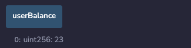

# FT5004_FinalProj

## Contents

* [Description](#description)
* [Usage](#usage)
* [Implementation](#implementation)

# Description
The Rock Paper Scissors game implemented here is a 3-player version game. The smart contract is written in Solidity language in Remix IDE. This can be deployed onto Ethereum Blockchain. The game logic is as follows:

1. Player A places a bet and makes a move. Player A then waits for players B and C to place their bets and make corresponding moves, which are entered along with the password. 
2. Once all 3 players make move, each of them reveal their move and player gets verified by the smart contract.
3. If all 3 players play the same move, the game results in a draw and each player gets their own bet back.
4. If each of the 3 players play a different move, then this will also result in a draw and each player gets their own bet back. 
5. If one player plays a move (E.g. Rock) and the other 2 players play a different move (E.g., Scissors), the player who played Rock will win the game and receive all the money from the betting pool.
6. If two players play the same move (E.g. Rock) and the remaining player played a different move (E.g., Scissors), the 2 players will win the game. Here the betting pool will be divided into half and given to each winner.
7. The game is reset and can be played by new players.

# Usage 
1. This game uses a token called `RPSToken` to trade. 
2. Buy RPStokens with function `TopUp`. Players can check the balance of a wallet by calling the `balanceOf(address)` function.

3. Register with function `register()`. Player must send a bet that is greater than or equal to both the minimum `BET_MIN` and to the first player's bet (if defined). Player can check the minimum bet with function `BET_MIN`. Please note that there will be a 1 token commission fee charged upon registration, the commission fee is shown with `COMMISSION_FEE`. 

The platform will then deduct the amount of bet plus commission fee from the player's account. Player can check the account balance with function `userBalance`.

4. Commit the move with function `play(bytes32 encrMove)`. The format of `encrMove` is `"move-password"` hashed using the SHA256 hash. `move` is an integer ranges from 1 to 3, where 1 corresponds to Rock, 2 corresponds to Paper, and 3 corresponds to Scissors. 
And `password` is a string that the player must memorise. 

5. Only when all players have played then they can start revealing their moves with `reveal(string clearMove)`. The format of the expect input is `"move-password"`. Players can check if all players have played or revealed with functions `allPlayed` and `allRevealed`. 

6. After the reveal process is completed, players can check outcome of the game with function `getOutcome`. Rewards will be distributed based on the game rule defined above. 
7. The `inputs.py` file is used to generate SHA256 hash for players 

## Implementation
### Registration Phase 
A player can only register if he/she has not registered previously. Upon registering, the player gives permission to the platform to deduct bet and fees from his/her account.
### Commit Phase 
The commit phase is secured by the SHA256 hash function. Nobody will have access to his/her opponent's move before the reveal phase. With that being said, players should remember their passwords for the reveal phase.
### Reveal Phase 
After all players have been committed, any one of the players can start the reveal phase by entering their move and password. The platform will then validate if the input corresponds to the actual input from the commit phase. Note that there is time limit of 10mins for the reveal phase, if players fail to reveal within the time limit the reward will be split accordingly and give to those who have revealed. Note that the bet will not be returned if one fails to reveal.
### Result Phase 
When the reveal phase ends, the platform will announce the outcome with the function `getOutcome`. The reward policy will follow the game rules defined above. Note that for those who fail to reveal, it will be considered as automatically lose. 